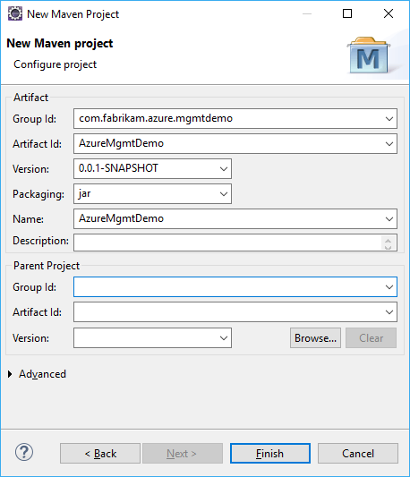
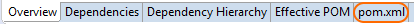
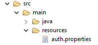

# Get started with Azure development with Java and Eclipse

This guide walks you through creating a command line tool with Eclipse that connects to Azure and lists virtual machines in a [resource group](https://docs.microsoft.com/en-us/azure/azure-resource-manager/resource-group-overview).

## Prerequisites

- [Eclipse](https://eclipse.org/downloads)
- [Azure CLI 2.0](https://docs.microsoft.com/en-us/cli/azure/install-az-cli2)

## Create your project

1. Create a simple Maven project in Eclipse. Select **File** > **New** > **Maven Project**. In **New Maven Project**, select **Create a simple project** and **Use default workspace location**. Select **Next**.
2. On the second page of **New Maven Project**, enter the following:

   - Group ID: `com.<username>.azure.mgmtdemo`  
   - Artifact ID: AzureMgmtDemo  
   - Version: 0.0.1-SNAPSHOT  
   - Packaging: jar  
   - Name: AzureMgmtDemo  

   

3. Select **Finish**

## Import your dependencies

1. Double-click the **pom.xml** file in the Eclipse Project Explorer.   
2. Select the **pom.xml** tab at the bottom of the window that appears.   
			
3. Add the following XML after the `</name>` tag but before the `</project>` tag.

```XML
<dependencies>
<dependency>
    <groupId>com.microsoft.azure</groupId>
    <artifactId>azure</artifactId>
    <version>1.0.0-beta5</version>
</dependency>
</dependencies>
```

Eclipse will connect to Maven Central and download the Azure management libraries along with their dependencies.

## Set up authentication

Register your application with Azure Active Directory so your app can view (but not update) your resources in Azure. This guide uses the [Azure CLI 2.0](https://docs.microsoft.com/en-us/cli/azure/install-az-cli2) , but you
can also [create the service principal via the web portal](https://docs.microsoft.com/en-us/azure/azure-resource-manager/resource-group-create-service-principal-portal).

### Create a service principal

Create a [service principal](https://docs.microsoft.com/en-us/azure/active-directory/develop/active-directory-application-objects#application-registration) to authenticate your application.
Service principals let you set application access separate from user accounts and identities. 

1. Log in using the Azure CLI 2.0 with `az login`. 
2. List the subscriptions for your account with `az account list`.
3. Select the subscription for your service principal to access with `az account set --subscription <subscription name>`. 
4. Create the service principal with `az ad sp create-for-rbac -n "AzureMgmtDemo" --role reader --output json`. Keep the output from this command to a safe place as it has information you'll
need to use in the next step.

### Create the credential file

Create a properties file with the service principal information from the previous step. This file will be passed to the Azure management API to authenticate our app.

Right-click the **src/main/resources** folder in **Project Explorer** and select **New** > **File**. Enter *auth.propeties* in the **File name:** field, then select **OK**.
      

Enter the following properties into this file:

```
subscription=########-####-####-####-############
client=########-####-####-####-############
key=XXXXXXXXXXXXXXXX
tenant=########-####-####-####-############
managementURI=https\://management.core.windows.net/
baseURL=https\://management.azure.com/
authURL=https\://login.windows.net/
graphURL=https\://graph.windows.net/
```

Update this property file with the following changes:

- subscription = use the *id* value from `az account list`
- client = use the *appId* value from the output taken from the service principal created in the previous step
- key = use the *password* value from the service principal creation output
- tenant - use the *tenant* value from the service principal creation output

## Create the application

Create a new class in the **src/main/java** source folder Eclipse (Right click the source folder, then select **New** > **Class**). Enter AzureMgmtDemo in the **Name:** field. 
Keep the defaults for the rest of the options and select **Finish**. 

Eclipse will open the source file for editing. Enter the following code into the file:

```java
import com.microsoft.azure.management.compute.VirtualMachine;
import com.microsoft.azure.management.Azure;
import com.microsoft.azure.PagedList;

import java.lang.ClassLoader;
import java.io.File;

public class AzureMgmtDemo {

    public static void main(String[] args) {

        try {

            // authenticate the app with Azure using the properties file created earlier
            ClassLoader classLoader = Thread.currentThread().getContextClassLoader();
            File authfile = new File(classLoader.getResource("auth.properties").getFile());
            Azure azure = Azure.authenticate(authfile).withDefaultSubscription();

			// get a list of virtual machines
            PagedList<VirtualMachine> vmlist = azure.virtualMachines().list();
            for (VirtualMachine vm : vmlist) {
                if (vm != null) {
                    // write information about the VMs to the console
                    System.out.println("Found virtual machine " + vm.name()
                            + " with size " + vm.size() + " in resource group " + vm.resourceGroupName()
                            + " with state " + vm.powerState());
                }
            }
        } catch (Exception e) {
            System.err.println("Error listing virtual machines in resource groups: "
                    + e.getMessage());
        }
    }
}
```

## Run the sample 

Run the code by selecting the Run button in Eclipse (  , shortcut Ctrl+F11) or from the **Run** menu. The output from the application will display in the **Console** window.

```
Found virtual machine myAzureVM with size Standard_DS1_v2 in resource group myazresgroup with state PowerState/running
```

## Learn more

See the How-Tos for more detailed samples on how to integrate Azure services into your application and manage your Azure resources from your code.
